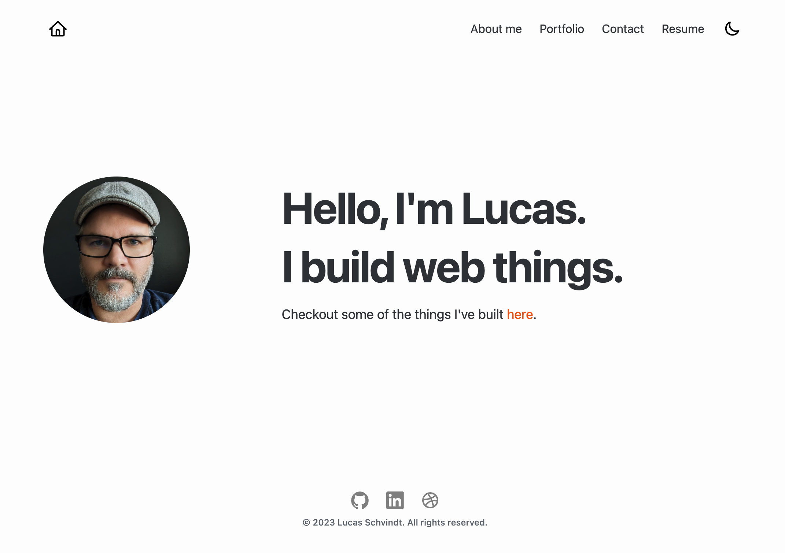

# REACT: React portfolio

## Description
A React portfolio application built with Vite and deployed to Netlify.

## What it should look like:

## Installation
N/A

## License
MIT

## GitHub
GitHub Repository: https://github.com/skywalkah/react-portfolio

## Deployed Application
Application: https://chimerical-dolphin-110366.netlify.app/